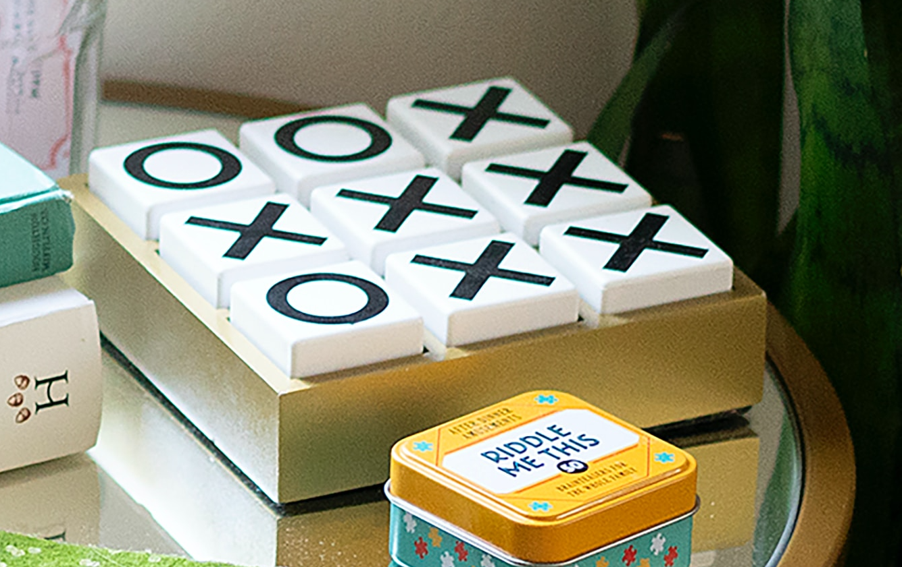

# cpp-tic-tac-toe

# Tic-Tac-Toe

## Description

Tic-Tac-Toe is paper-and-pencil game, where two players can play. 
It's results will be one of two, win or fraw.

As this uses Xs and Os, it is referred to as noughts and crosses (Commonwealth English).

Photo by <a href="https://unsplash.com/@treatzone?utm_content=creditCopyText&utm_medium=referral&utm_source=unsplash">Matthew Davis</a> on <a href="https://unsplash.com/photos/white-and-green-box-on-table-iCp8p7wVXS0?utm_content=creditCopyText&utm_medium=referral&utm_source=unsplash">Unsplash</a>

### Rules and Conditions

- Played by two players
- It is a three-by-three grid with X or O
- If a player is succeeded in placing three of their marks in a horizontal, vertical, or diagonal row is the winner.
- A draw can be achieved if played with good understanding.

    | <u>1</u> | <u>2</u> | <u>3</u> |
    | <u>4</u> | <u>5</u> | <u>6</u> |
    | <u>7</u> | <u>8</u> | <u>9</u> |

##### ***Here I have used C++ to write a program where it is played by computer itself, output show on the console.***

